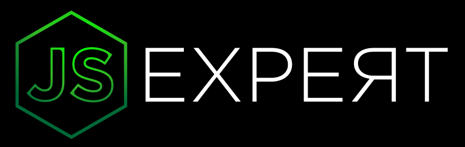

  

  

  

  

    <h1>Aquecimento Semana Javascript Expert 3</h1>

<h1 align="center">
    
</h1>

## 📖 Sobre este repositório

Repositório criado com o objetivo de armazenar os exercícios realizados durante o aquecimento à Semana Javascript Expert.

---

## [Dia 01 - ECMAScript Modules](./01-esmodules)
- [x] ECMAScript Modules vs CommonJS
- [x] Retrocompatibilidiade
  
---